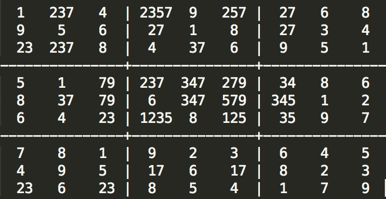

# Artificial Intelligence Nanodegree
## Introductory Project: Diagonal Sudoku Solver

# Question 1 (Naked Twins)
Q: How do we use constraint propagation to solve the naked twins problem?

A: If 2 digits can only appear in 2 boxes within the same unit, then they must appear in those 2 boxes since, 
according to the rules of sudoku, all the digits have to appear in the unit. This means 2 things:
- No other digit can appear in those 2 boxes.
- The 2 digits cannot appear in the other boxes of the unit.
Applying these constraints helps reducing the search space.

In `naked_twins()`, we considered that we were solving a regular sudoku problem (not a diagonal sudoku) and
looked for twins in each row, column and square.
Therefore, the grid obtained in the test case is the following.



If we were solving a diagonal sudoku problem, the naked twins method would have noticed that D4 and E5 are the only 2 cells
that can contain 3 and 7 in the diagonal and would have reduced the search space accordingly.


# Question 2 (Diagonal Sudoku)
Q: How do we use constraint propagation to solve the diagonal sudoku problem?

A: For the diagonal sudoku problem, we use the same constraint propagation method as for regular sudokus ("elimitate" and "only choice") but apply them to 2 extra units (the 2 diagonals), on top of rows, columns and squares. This reduces the search space more aggressively.

### Install

This project requires **Python 3**.

We recommend students install [Anaconda](https://www.continuum.io/downloads), a pre-packaged Python distribution that contains all of the necessary libraries and software for this project. 
Please try using the environment we provided in the Anaconda lesson of the Nanodegree.

##### Optional: Pygame

Optionally, you can also install pygame if you want to see your visualization. If you've followed our instructions for setting up our conda environment, you should be all set.

If not, please see how to download pygame [here](http://www.pygame.org/download.shtml).

### Code

* `solutions.py` - You'll fill this in as part of your solution.
* `solution_test.py` - Do not modify this. You can test your solution by running `python solution_test.py`.
* `PySudoku.py` - Do not modify this. This is code for visualizing your solution.
* `visualize.py` - Do not modify this. This is code for visualizing your solution.

### Visualizing

To visualize your solution, please only assign values to the values_dict using the ```assign_values``` function provided in function.py

### Data

The data consists of a text file of diagonal sudokus for you to solve.
